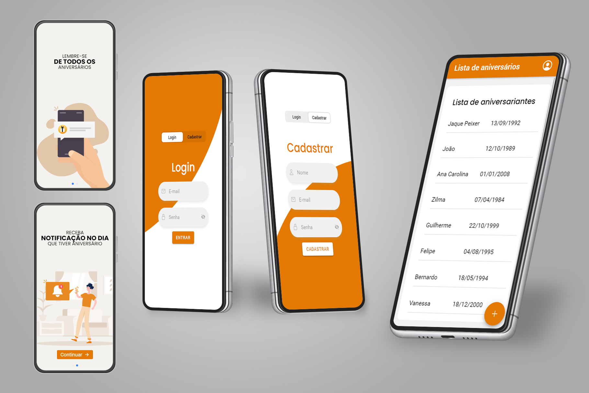

# Aplicativo Lista de aniversário
O objetivo principal do aplicativo é informar o usuário através de notificação quando alguém de sua lista esta de aniversário.

## Tecnologia
O projeto foi desenvolvido com IONIC 5 e utilizado SCSS para estilização dos campos.

## Status de andamento do projeto
Finalizando, está faltando a finalização da função de Push Notifications, o qual é o foco do estudo deste aplicativo.
